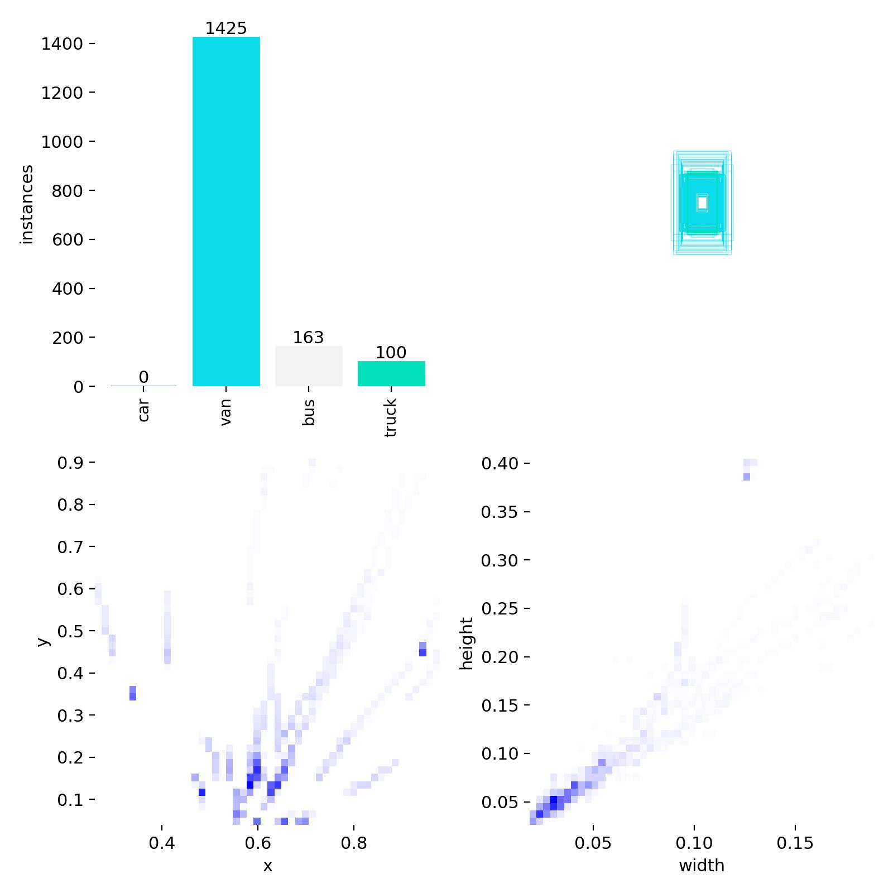
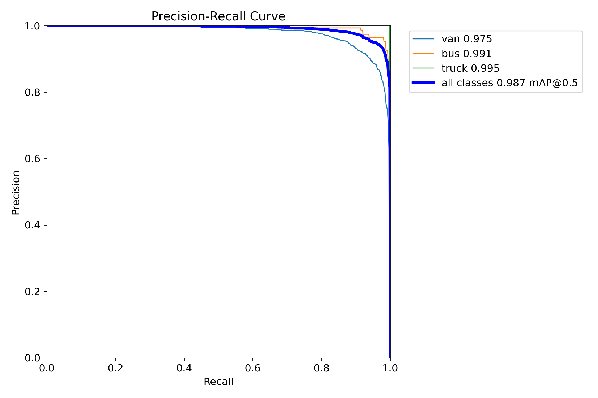
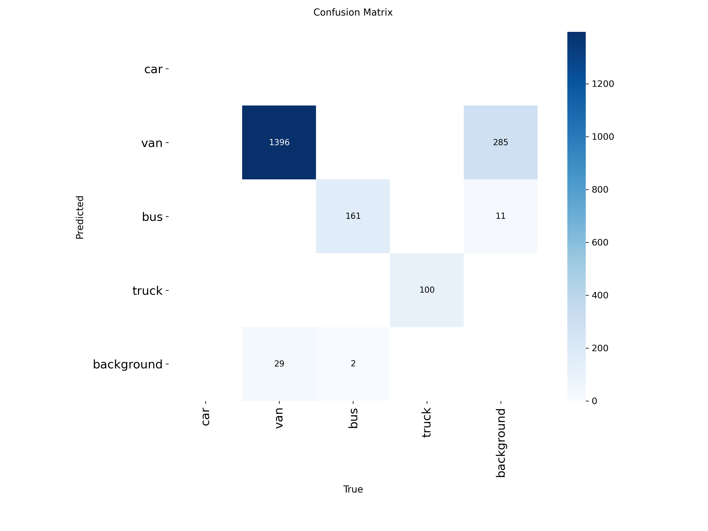

# Vehicle Object Tracking with YOLO

## Description

A traffic object detection and tracking project using the UA-DETRAC custom dataset, YOLO training, and video tracking with persistent IDs.

## Key Features

- Kaggle/UA-DETRAC dataset preparation
- YOLO-compatible dataset conversion
- Custom detector training
- Traffic video tracking with persistent IDs
- Saved model weights and result plots

## Tech Stack

- Python
- Jupyter Notebook
- Ultralytics YOLO
- KaggleHub
- OpenCV
- FFmpeg

## Installation

pip install ultralytics kagglehub opencv-python

## Usage

Open `Untitled29.ipynb`, configure Kaggle access, run dataset preparation/training cells, then run the tracking cells on a traffic video.

## Screenshots

## License

No license file is currently included. Add a license before reusing, distributing, or publishing this project for public collaboration.

